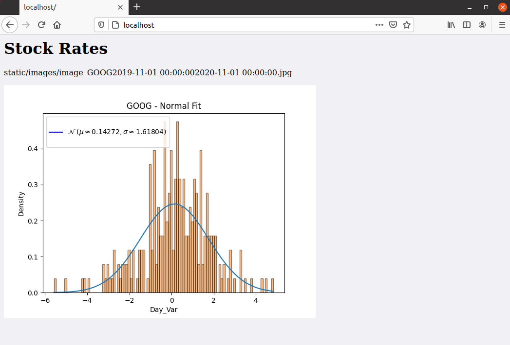

# Docker Project


```
Πανεπιστήμιο Πειραιώς
Τμήμα Ψηφιακών Συστημάτων
Π.Μ.Σ. "Πληροφοριακά Συστήματα & Υπηρεσίες"
Ειδίκευση "Μεγάλα Δεδομένα και Αναλυτική"
```

```
Ατομική Απαλλακτική Εργασία Εξαμήνου

Διδάσκών : Κυριαζής Δημοσθένης
Ακαδημαικό Εξάμηνο 1ο 

Ζερβούδη Στέφανος - ME2009
```


# Application Description

```reStructuredText
Η παρούσα εργασία κατασκευάστηκε ώστε να μας δίνει με τυχαία σειρά αποτελέσματα διακυμάνσεων μέσω της κανονικής κατανομής,
από το διάστημα 01-11-2019 έως 01-11-2020 (διαλέξαμε το συγκεκριμένο χρονικό διάστημα διότι υπήρχαν μεγάλες διακυμάνσεις τιμών 
λόγω του COVID-19), για τις μετοχές των εταιρειών { IBM / Google / Facebook }.

Η εφαρμογή μας κατεβάζει τα δεδομένα  της τυχαίας εταιρείας για το χρονικό περιθώριο το οποίο έχουν ορίσει από την ιστοσελίδα 
της yahoo καθώς επίσης τα αποθηκεύει σε ένα αρχείο Excel. Στην συνέχεια υπολογίζει την ποσοστιαία μεταβολή στις Τιμές Ανοίγματος 
και Τιμές Κλεισίματος των μετοχών, κανονικοποιεί τα δεδομένα και στο τέλος αναπαριστά την ποσοστιαία μεταβολή σε ένα ιστόγραμμα.

Γίνεται σύνδεση δύο container του mycontainer που περιέχει την εφαρμογή Flask-app, με τον NGINX όπου μπορεί να δέχεται πολλά 
αιτήματα την ιδία στιγμή διότι o web-server λειτουργεί σαν reverse proxy & load balancer. 

Η παρούσα Εργασία εκτελέστηκε σε Linux περιβάλλον (Ununtu version 20.4). 
```


## 1. Step by Step_Building Docker - Project


**Create** [Dockerhub Account](https://hub.docker.com/) 

​	My Username is  : szervoudis

---


#### Create the  Docker-Project File

```bash
mkdir Desktop

cd Desktop
cd Docker
cd APP
```


#### Create Dockerfile

```bash
nano Dockerfile		# You will find below, the Dockerfile 

cat Dockerfile		# If we want to see the code of Dockerfile
```


#### Create Requirements

```bash
nano requirements	# You will find below, the requirements.txt

cat requirements.txt	# If we want to see the code of reuirements.txt  
```


#### Build a Container

```bash
sudo docker build -t szervoudis/mycontainer .	# Create our container with name: mycontainer
```


#### Run the container

```bash
sudo docker run -p 8080:5000 szervoudis/mycontainer	# Run the container to the port --> https://localhost:8080
```


#### Push the Container in Dockerhub

```bash
sudo docker push szervoudis/mycontainer	
```


#### **Install docker-compose**

```bash
Step 1:

sudo curl -L "https://github.com/docker/compose/releases/download/1.27.4/docker-compose-$(uname -s)-$(uname -m)" -o /usr/local/bin/docker-compose
```

```bash
Step 2:

sudo chmod +x /usr/local/bin/docker-compose
```
```bash
Step 3:

docker-compose --version
```

``` bash
OR

sudo apt-get install python3-pip -y
sudo pip3 install docker-compose
```


#### Create the configuration file

```bash
cd Desktop
cd Docker

nano nginx.conf		# You will find below, the nginx.conf

cat nginx.conf		# If we want to see the code of nginx.conf   
```


#### Create docker-compose.yml 

```bash
cd Desktop
cd Docker

nano docker-compose.yml		# You will find below, the docker-compose.yml

cat docker-compose.yml		# If we want to see the code of docker-compose.yml         
```


#### Run docker-compose 

```bash
sudo docker-compose up
```


#### Stop docker-compose

```bash
sudo docker-compose down
```


#### Create a GitHub repository

```bash
Name of Repository is : Docker-Project

# Go to the Github and get the HTTPS link of the project.
```	
Link: https://github.com/szervoudis1/Docker-Project
```bash
# So we can go ahead and clone the repository locally like so with the following command :

git clone https://github.com/szervoudis1/Docker-Project.git
```


## 2. Execution  Commands for the Docker - Project


#### **Run the application from Ubuntu Terminal**

1. git clone https://github.com/szervoudis1/Docker-Project.git
2. cd Docker-Project
3. cd Docker
4. sudo docker-compose up 
5. https://localhost:80
   * Result : 



5. sudo docker-compose down


## 3. Code - Files


#### Dockerfile

```dockerfile
FROM python:3.8

COPY ./requirements.txt /requirements.txt

# Set a directory for the app
WORKDIR /

# Install dependencies
RUN pip3 install -r requirements.txt

# Copy all the files to the container
COPY . /

# Tell in which port number the container will be exposed
EXPOSE 5000

ENTRYPOINT ["python3"]

# Run the command
CMD ["app.py"]
```


#### requirements

```python
flask==1.1.2

pandas==1.1.4

numpy==1.19.4

matplotlib==3.3.3

scipy==1.5.4

pandas-datareader

openpyxl
```


#### app.py

```python
from flask import Flask,render_template,send_file
import io
import os
import random
import datetime
import pandas as pd
import pandas_datareader.data as web
import numpy as np
import matplotlib.lines as mlines
import matplotlib.pyplot as plt
from scipy.stats import norm

app = Flask(__name__)


list_of_stocks = ['IBM','GOOG','FB']
image_name = ''


def inputs(Stock_name,start_date,stop_date):
    df = None
    df = web.DataReader(f'{Stock_name}','yahoo',start_date,stop_date)
    df.to_csv(f'{Stock_name}' + ' - Rates.csv')

def daily_fluctuation(Stock_name):
    df = pd.read_csv(f'{Stock_name}' + ' - Rates.csv')
    df['Fluctuation'] = 100 * (df['Close'] - df['Open']) / df ['Open']
    output_excel_writer = pd.ExcelWriter(f'New_{Stock_name}.xlsx')
    df.to_excel(output_excel_writer, index=False)
    output_excel_writer.save()
    output_excel_writer.close()   

def normalize(Stock_name):
    df = None
    df = pd.read_excel(f'New_{Stock_name}.xlsx',engine='openpyxl')
    # Υπολογσιμός Standard Deviation & Mean
    std = np.std(df['Fluctuation'],ddof=1)
    mean = np.mean(df['Fluctuation'])  

    bins = (df['Fluctuation'].max() - df['Fluctuation'].min()) * 10
    bins = int(bins)

    plt.clf()
    domain = np.linspace(np.min(df['Fluctuation']),np.max(df['Fluctuation']))
    plt.plot(domain,norm.pdf(domain,mean,std))
    plt.hist(df['Fluctuation'], edgecolor = 'black',alpha=0.5,bins=bins, density=True)
    plt.title(f'{Stock_name}' + " - Normal Fit")
    plt.xlabel("Day_Var")
    plt.ylabel("Density")

    # Title box with blue line
    blue_line = mlines.Line2D([], [], color='blue', marker='',markersize=10,
                        label= "\n" + '$\mathcal{N}$ ' +  
                        f'$( \mu  \\approx {round((mean),5)} , \
                           \sigma  \\approx {round((std),5)} )$\n')
    plt.legend(handles=[blue_line])

def save_image():
      plt.savefig('static/images/' + image_name)

PEOPLE_FOLDER = os.path.join('static', 'images')
app.config['UPLOAD_FOLDER'] = PEOPLE_FOLDER


@app.route('/')

def index():  
	# 1
    Stock_name = random.choice(list_of_stocks)
    print("The Chosen Stock Name : " + f'{Stock_name}')
    start_date = datetime.datetime(2019,11,1)
    stop_date = datetime.datetime(2020,11,1)  

    # 2
    inputs(Stock_name,start_date,stop_date)    
    # 3
    daily_fluctuation(Stock_name)   
    # 4
    normalize(Stock_name)   

    global image_name
    image_name = 'image_'+ Stock_name + str(start_date) + str(stop_date) + '.jpg'   
   
    # 5
    save_image()       

    full_filename = os.path.join(app.config['UPLOAD_FOLDER'], image_name)
    return render_template("index.html", user_image = full_filename)

if __name__ == "__main__":
  
    # Export Port
    app.run(host='0.0.0.0',port=5000,debug=False)   
```


#### nginx.conf

```bash
server {
    listen 80;
    server_name localhost;

    location / {
        proxy_pass http://flask-app:8080/;
        proxy_set_header Host "localhost";
    }
}
```


#### docker-compose.yml

```yaml
 version: '3.1'
 services:
     nginx:
         image: nginx:1.13.7
         container_name: nginx
         restart: always
         depends_on:
             - stef_flask_app
         volumes:
             - ./nginx.conf:/etc/nginx/conf.d/default.conf
         networks:
             - my-network
         ports:
             - 80:80

     stef_flask_app:
         build: 
            context: ./APP 
            dockerfile: Dockerfile
         container_name: mycontainer
         restart: always
         environment:
             - ./app.py
         networks:
             my-network:
                 aliases:
                     - flask-app

 networks:
    my-network:
```

#### index.html

```html
<html>
  <head>
  <link rel="stylesheet" href="/static/images/style.css">
  </head>
  <body>
    <h1>Stock Rates</h1>
  <p>{{ user_image }}</p>
  
  </body>
</html>
```

#### style.css

``` HTML
body {
  background-color: #f0f0f5;
}
```


 

